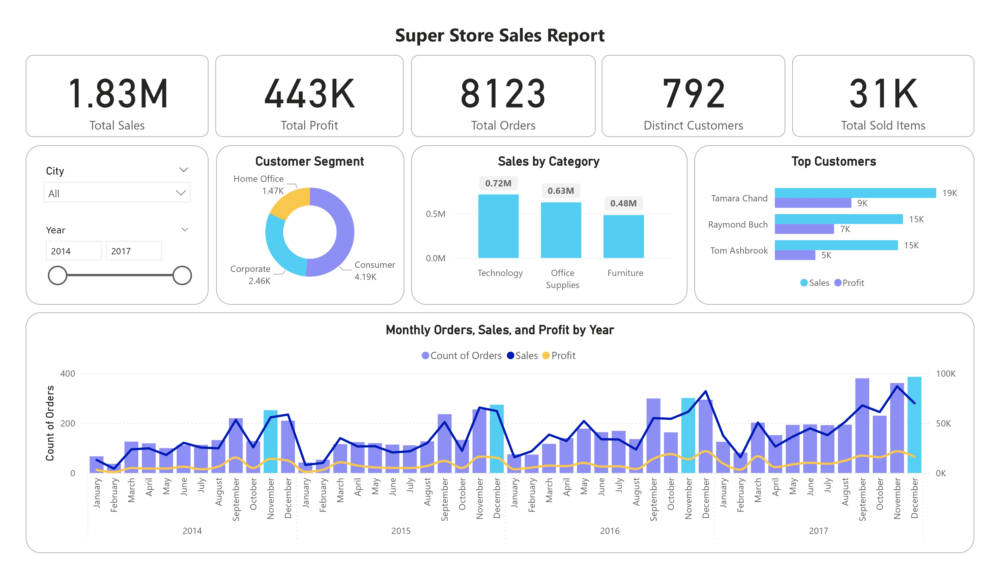

# 🏪 Superstore Sales & Profit Analysis 📈

This project is an end-to-end **Exploratory Data Analysis (EDA)** and **Interactive Dashboard** built on Kaggle’s [Superstore Dataset](https://www.kaggle.com/datasets/vivek468/superstore-dataset-final).

The goal is to help a retail giant understand what sells best, who buys the most, which regions perform well, and where they can cut losses and boost profits.

---

## 📂 Dataset Overview

- **Source:** Kaggle Superstore Dataset  
- **Records:** ~10,000 rows  
- **Features:** 21 columns — Orders, Customers, Products, Sales, Profit, Discounts, Shipping, Regions, and more.

---

## 🛠️ Tools & Technologies

- **Python**: Pandas, Seaborn, Matplotlib for data cleaning, transformation & EDA.
- **Power BI**: For building an interactive, business-friendly dashboard.
- **Jupyter Notebook**: For code, visualizations & insights.

---

## 📊 Key Insights

- 📈 **Profit Drivers:** Technology yields the highest average profit, while Furniture often underperforms.
- 🚚 **Shipping:** Faster shipping modes reduce delays but may affect profit margins.
- 🔍 **Discounts:** Higher discounts are strongly linked with lower profit.
- 👥 **Customers:** 97%+ repeat customer rate — clear loyalty opportunity.
- 📌 **Regions:** East & West regions bring the strongest profit, Central lags behind.
- ⚡ **Seasonality:** Orders peak in November & December.

---

## ⭐ Recommendations

- ✅ Reduce high discounts on low-margin categories.
- ✅ Promote high profit-per-unit products.
- ✅ Target top-performing regions with marketing campaigns.
- ✅ Improve shipping efficiency to cut costs.
- ✅ Design loyalty programs to keep repeat customers engaged.

---
## 📸 Dashboard Preview



---

## 📎 Project Structure

```plaintext
├── notebook/
│   ├── superstore_analysis.ipynb  # Python EDA notebook
├── dashboard/
│   ├── superstore_dashboard.pbix  # Power BI dashboard file
├── data/
│   ├── Sample - Superstore.csv    # Raw dataset (or Kaggle link)
├── README.md                      # Project overview & instructions
```

---

## 🚀 How to Run

1. **Clone** this repository  
2. Open the **Jupyter Notebook** for Python EDA  
3. Open the `.pbix` file in Power BI Desktop for the dashboard

---

## 📌 Credits

- **Dataset:** [Superstore Dataset on Kaggle](https://www.kaggle.com/datasets/vivek468/superstore-dataset-final)

---

## 🤝 Let’s Connect

Open to feedback, suggestions, or collaboration!  
Feel free to **fork** this repo or connect with me on [LinkedIn](https://www.linkedin.com/in/reham-mahmoud-rushdi/).

---

**#DataAnalytics #PowerBI #Python #DataVisualization #BusinessInsights #Kaggle**
